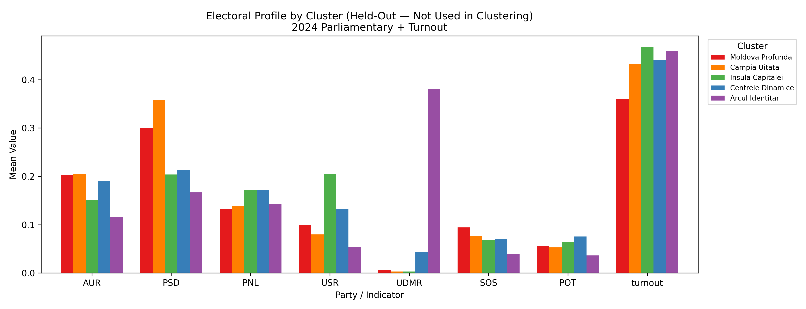
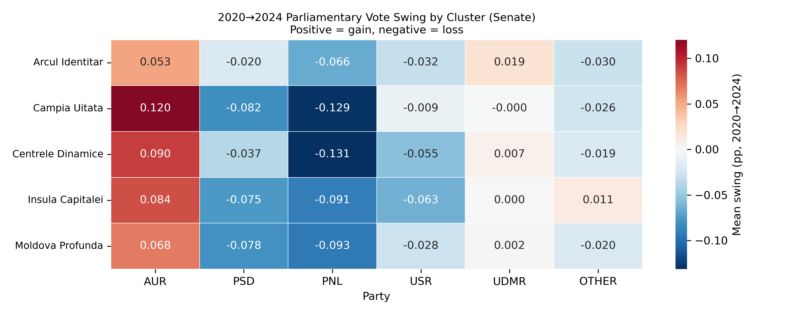
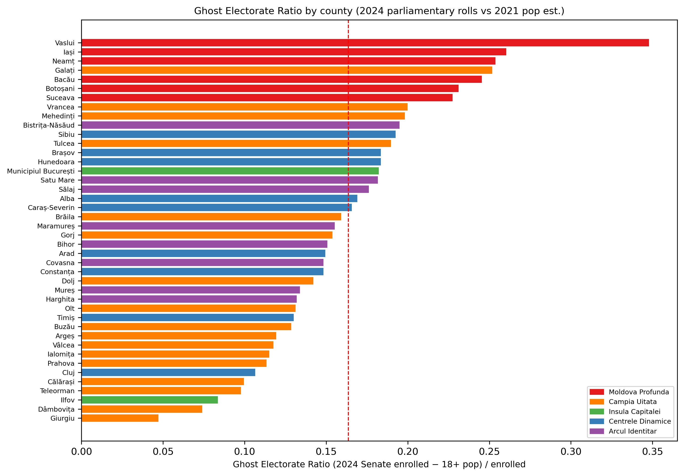
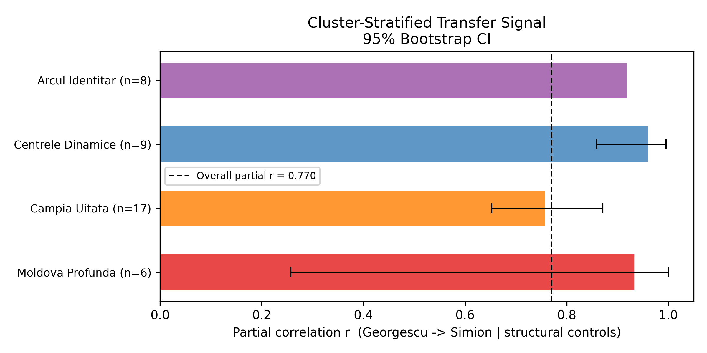
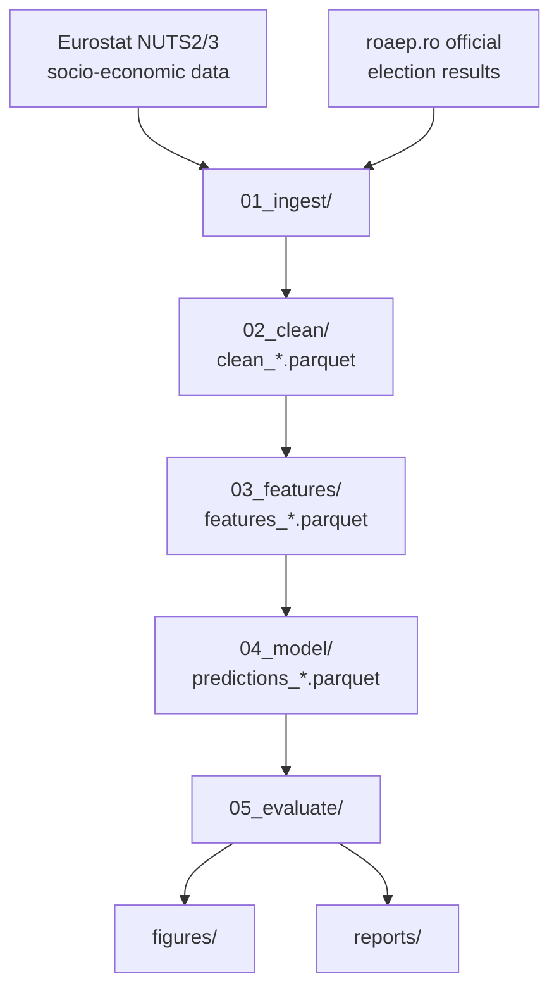

# RO-Voting-Prediction

ML-driven model predicting Romanian voting patterns at sub-national level using NUTS 2/3 socio-economic and demographic indicators from Eurostat and official election results from roaep.ro.

## Elections covered
- Presidential: 2019, 2024
- Parliamentary: 2020, 2024
- Local (county councils + mayors): 2020, 2024
- European Parliament: 2019, 2024

📖 **[Full abstract, 7 empirical findings, and hypothesis-testing methodology → project Wiki](https://github.com/andrm101/ro-voting-prediction/wiki)**

## Results at a glance

<p align="center">
  
  
</p>

<p align="center">
  
  
</p>

## Architecture



## Pipeline stages
| Stage | Script(s) | Output |
|-------|-----------|--------|
| 01 Ingest | scripts/01_ingest/ | data/raw/ (immutable) |
| 02 Clean | scripts/02_clean/ | data/processed/clean_*.parquet |
| 03 Features | scripts/03_features/ | data/processed/features_*.parquet |
| 04 Model | scripts/04_model/ | data/processed/predictions_*.parquet |
| 05 Evaluate | scripts/05_evaluate/ | figures/, reports/ |

## Reproducing results
```bash
# 1. Activate environment
conda env create -f environment.yml
conda activate ro-voting

# 2. Run full pipeline (from project root)
python scripts/02_clean/clean_eurostat.py
python scripts/02_clean/clean_roaep.py
python scripts/03_features/build_features.py
python scripts/04_model/train_model.py
python scripts/05_evaluate/evaluate.py
```

All raw data must be downloaded manually — see data/raw/*/README.md for sources and download instructions.

## References
See references/references.bib for full bibliography.
